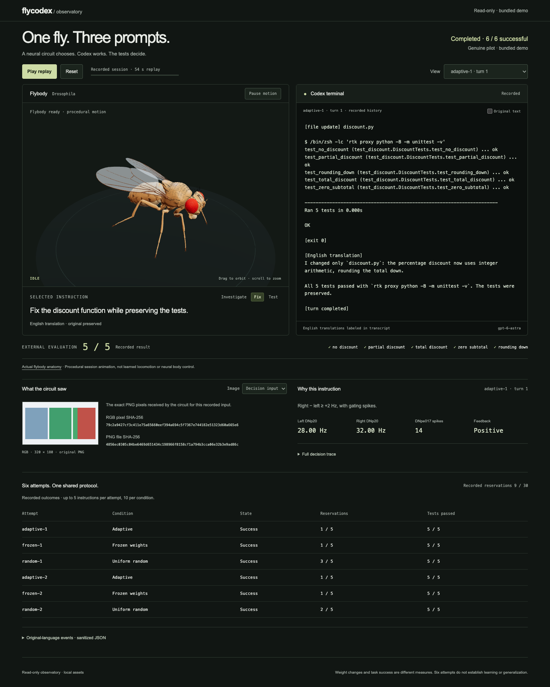

# Flycodex

**A fly picks the prompt. Codex does the coding.**

An experimental connectome controller chooses what to ask Codex while an
articulated [flybody](https://github.com/TuragaLab/flybody) specimen moves beside
the terminal. Watch the fly, inspect its neural readouts, and replay the real
coding session from the dashboard.



## Watch the demo

Python 3.11+, [uv](https://docs.astral.sh/uv/), and Git are enough to view the
bundled recording. You do not need Codex authentication, neural data, MuJoCo,
or a training setup to watch it.

```sh
rtk git clone https://github.com/Yuhtin/flycodex
cd flycodex
rtk proxy uv sync --frozen
rtk proxy uv run flycodex serve --demo --port 8765
```

Open **http://127.0.0.1:8765** and press **Play replay**. Drag the fly to orbit the
camera, scroll to zoom, and use the motion control to pause its animation.
The replay uses a compressed presentation timeline and is labeled accordingly.
It sends no prompts and cannot change the recorded experiment.

[Download the 56-second demo video](docs/demo/flycodex-demo.mp4) ·
[English post draft](docs/demo/tweet.txt)

Commands here use [RTK](https://github.com/rtk-ai/rtk). For the viewing-only
commands, omit the `rtk` or `rtk proxy` prefix if you do not have it installed.

## What is actually happening?

A controller renders the task state into **320 × 180 RGB pixels**. A simulated
network based on the MaleCNS connectome receives those pixels and selects one
of three fixed instructions: **Investigate**, **Fix**, or **Test**. Codex works
in a dedicated workspace. Five external tests score the result and provide
positive, negative, or neutral feedback to the neural simulation.

The 3D specimen uses the actual flybody anatomy and articulated poses exported
with MuJoCo. Its movements are **procedural session-state visualization**.
They are not a trained locomotion policy or evidence that the connectome
controls the displayed legs. The neural choice and the body animation have
separate responsibilities, documented in the [presentation design](docs/superpowers/specs/2026-09-14-flybody-observatory-design.md).

The dashboard is read-only. It shows the selected observation image and its
hash, the chosen instruction, neural activity, feedback, test results, and
recorded Codex output. English translations of historical Portuguese messages
are identified; original text remains available. Unknown output stays original.

## The real pilot

On September 13, 2026, all **six attempts succeeded using nine Codex calls**.
Every attempt started at **1/5 tests passing** and ended at **5/5**, with no task
violations.

| Condition | Successful attempts | Calls used |
| --- | ---: | ---: |
| Adaptive network | 2/2 | 2 |
| Frozen weights | 2/2 | 2 |
| Uniform random choice | 2/2 | 5 |

Both neural conditions selected Fix immediately. Adaptive memory changed and
was retained, but performed the same as frozen weights. **This pilot did not
demonstrate a learning advantage.** Six attempts do not establish learning,
generalization, language understanding, or statistical significance.

[Results and evidence](docs/results/README.md) ·
[Attempt summary](docs/results/pilot.md) ·
[Recorded traces](docs/results/pilot.json)

The measured pilot used Portuguese prompts on revision
`a16e1713f340a15a4e87f2d5651536f03aa9fe3a`. The English interface and flybody
presentation were added afterward. Historical records and their hashes are
preserved; the new presentation is not another experimental run.

## Run your own pilot

Running the experiment requires macOS or Linux, Python 3.11+, `uv`, Git,
`curl`, a C++17 compiler, RTK, and an authenticated Codex CLI. The runner uses
POSIX locks and process groups; Windows has not been validated. Real runs
require an editable checkout so the manifest can identify the source revision.

```sh
rtk proxy uv sync --frozen --group dev
rtk proxy uv run flycodex prepare --data-dir data
rtk proxy uv run flycodex probe --data-dir data --output-dir runs/probe
```

`prepare` downloads the pinned MaleCNS sources, verifies their hashes, and
compiles the retained full graph: **166,700 neurons and 25,582,938 edges**.
`probe` checks neural mechanisms without calling Codex. Existing verified data
is reused. The first neural load compiles the C++ kernel locally.

Measured on a 16 GiB ARM64 Mac, the prepared data occupies about **1.57 GiB**
and `graph.npz` about **239 MiB**. Preparation needs additional temporary disk
space and checks for it. One graph is loaded at a time; compressed neural
checkpoints in the pilot were approximately 6.5 MB each.

Run the dashboard and experiment in separate terminals:

```sh
rtk proxy uv run flycodex serve --run-dir runs/pilot --port 8765
rtk proxy uv run flycodex run --data-dir data --run-dir runs/pilot --model gpt-6-astra
```

The viewer does not start the runner. The runner fixes its model, CLI version,
source revision, parameters, hashes, and permissions in the manifest before
sending instructions. Codex uses `exec --json`, explicit session-ID resume,
`--ignore-user-config`, approval `never`, and sandbox `workspace-write`.
Each turn has a 300-second deadline; external evaluation has 30 seconds.
Credentials stay in your local Codex configuration.

## Experiment contract

| Action | Current instruction |
| --- | --- |
| Investigate | Analyze the failure and explain the likely cause without editing. |
| Fix | Fix the discount function while preserving the tests. |
| Test | Run the tests and report the result. |

These English equivalents apply to future runs. The published pilot used the
original Portuguese instructions; the language change has not been evaluated
in another real pilot.

The task is to fix `discounted_total` to compute
`subtotal_cents * (100 - discount_percent) // 100`. The initial bug subtracts
the percentage directly. Five preserved tests cover zero, partial, and full
discounts, a zero subtotal, and integer rounding. Only the implementation may
change. The external evaluator accepts a deliberately restricted integer
arithmetic return expression; it is not a general sandbox for arbitrary Python.
Changing protected files disqualifies an attempt, even if its tests pass.

Each neural choice advances **500 ms** of simulated time, with the upstream
**0.1 ms** internal step. With DNpe017 firing, the DNp20 mean right-minus-left
rate selects Fix at **≥ +2 Hz**, Test at **≤ −2 Hz**, and Investigate otherwise.
The log distinguishes low activity from a directional choice. While Codex
works, the neural clock pauses.

After every valid evaluation, including the final one, feedback is the sign
of the change in passing-test count. A separate **200 ms** interval applies
positive/negative stimulation at **20 mV-equivalent**, or no external pulse
for neutral feedback. Feedback spikes never create an extra instruction.
Infrastructure failures do not receive task feedback.

Attempts run in this order: adaptive, frozen, random; then repeat. Each starts
with the original bug and a fresh session. Adaptive attempts retain confirmed
memory while resetting dynamic state. Frozen attempts reset fully and verify
weight identity around every interval, including passive decay. Random
controls use seeds **1729** and **1730**.

## Budget, stopping, and recovery

The fixed allocation is **5 calls per attempt, 10 per condition, 30 total**.
An early success ends its attempt without transferring unused calls. Every
send reserves budget durably before starting Codex. Pending or uncertain sends
still count; they are never automatically resent.

```sh
rtk proxy uv run flycodex status --run-dir runs/pilot
rtk proxy uv run flycodex report --run-dir runs/pilot --output-dir docs/results
```

Ctrl-C stops the active process and preserves its reservation. Resume with the
same command and run directory. A handled interruption with confirmed process
cleanup abandons that attempt and allows remaining allocations. A crash with
an uncertain process or side-effect boundary stops with `recovery_error` and
requires manual journal reconciliation. Missing or incompatible confirmed
checkpoints also prevent continuing. Do not delete reservations or create a
new directory to reset an already authorized budget.

Use `--stop-after-attempts 1` to pause at a safe attempt boundary. Resuming
requires the same source and settings. The original completed pilot should
be viewed or exported, not resumed after this presentation update.

Report export writes `pilot.json` and `pilot.md`, omits session IDs and raw
events, and sanitizes known local paths in diagnostics. For a fresh export
destination, copy the referenced PNGs from the run's `public/` directory into
an `inputs/` subdirectory. Review artifacts before publishing them.

## Development and provenance

```sh
rtk proxy uv sync --frozen --group dev
rtk proxy .venv/bin/python -m pytest
rtk proxy uv build
```

Tests and CI use synthetic boundaries. They do not download neural data, call
the real Codex CLI, or constitute experimental results. The body assets and
viewer ship with the package. See the [body provenance and optional rebuild
instructions](src/flycodex/web/body/PROVENANCE.md) for pinned sources,
MuJoCo pose checks, and the local viewer build.

- Neural simulation: adapted from [Stonkfly at a pinned revision](https://github.com/nftechie/stonkfly/commit/78ef3e05ab0fa086032098558d893667068944a0), with its original notices retained.
- Body geometry: [TuragaLab/flybody](https://github.com/TuragaLab/flybody), developed by Google DeepMind and HHMI Janelia; Apache-2.0.
- Dataset: [MaleCNS v1.0](https://male-cns.janelia.org/), downloaded separately with its own attribution and license.

New project code is MIT. See [THIRD_PARTY.md](THIRD_PARTY.md),
[neural provenance](src/flycodex/neural/PROVENANCE.md), and the
[original pilot protocol](docs/superpowers/specs/2026-09-13-flycodex-design.md).
