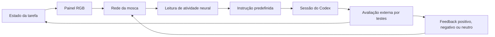

# Flycodex — desenho do piloto

Status: aprovado pelo usuário em 2026-09-13 para implementação. As decisões da entrevista estão em [design.md](../../design.md).

## Experiência

Uma rede simulada baseada no conectoma de uma mosca observa um painel, escolhe uma instrução predefinida e a envia a uma sessão dedicada do Codex. O Codex tenta corrigir um bug numa função de desconto. Os resultados de testes fixos alimentam o treinamento experimental. O espectador acompanha o painel, a atividade neural, a instrução enviada e a saída real do Codex.

O piloto tem até 30 instruções, inclui duas condições de comparação e pode ser publicado mesmo sem melhora demonstrada. O nome Flycodex continua provisório. A entrega open source inclui o código, as instruções de reprodução, as atribuições e o relatório completo do piloto.

## Fluxo

Um controlador coordena uma instrução por vez, o orçamento e o encerramento. Ele verifica se pode enviar a escolha, sem trocar uma escolha improdutiva por outra que resolva a tarefa. Toda decisão, inclusive a repetição de uma instrução, aparece no registro.

## Base neural e alternativas

Recomenda-se adaptar os módulos neurais necessários do Stonkfly na revisão `78ef3e05ab0fa086032098558d893667068944a0`, preservando os avisos de origem e documentando as alterações. O dataset será MaleCNS v1.0, preparado separadamente com os hashes de origem e de arrays do upstream. O simulador será o núcleo C++ com interface Python e a regra experimental de adaptação já existente. As fontes consultadas estão no fim deste documento.

Reutilizar o pacote inteiro exigiria carregar dependências de trading alheias à demo. Reimplementar toda a simulação aumentaria o trabalho de validação. A adaptação dos módulos neurais mantém a origem verificável e permite uma interface local específica, ao custo de manter esse código derivado.

O primeiro teste técnico deve preparar o grafo e verificar entrada visual, disparos, decodificação, adaptação, congelamento dos pesos e checkpoint no computador disponível. O modelo completo não será substituído silenciosamente por uma rede aleatória se houver problema de memória ou desempenho. A máquina observada tem ARM64 e 16 GiB de RAM; a execução ainda não foi testada.

## Painel de observação

O controlador produz uma imagem RGB de 320 × 180 pixels com fundo claro, posições fixas e três regiões: atividade do Codex, disponibilidade de resultado e proporção de testes passando/falhando. Quantidades são representadas por áreas preenchidas e contrastes de brilho; a legenda e os números para humanos podem ficar ao redor da imagem.

Só os pixels dessa imagem e o feedback explícito entram na rede. Código, texto da conversa e contagem numérica de testes não são fornecidos por outro caminho à política neural. O painel visto pelo espectador deve corresponder à imagem efetivamente usada pela rede, identificada por hash no registro.

A rede avança por 500 ms de tempo simulado para cada escolha, em intervalos de até 10 ms, com o passo interno de 0,1 ms do upstream. Enquanto o Codex trabalha, o painel mostra a atividade, mas o relógio neural fica pausado. Isso mantém o tempo de resposta do Codex fora da dinâmica da memória.

## Três instruções e sua decodificação

| Escolha | Texto enviado |
| --- | --- |
| Investigar | Analise a falha e explique a provável causa, sem editar. |
| Corrigir | Corrija a função de desconto, preservando os testes. |
| Testar | Execute os testes e relate o resultado. |

Recomenda-se manter os grupos de saída do Stonkfly: diferença entre a taxa média direita e esquerda de DNp20, com presença de disparos em DNpe017. Usar um limiar inicial fixo de 2 Hz e a seguinte associação, definida antes do piloto:

- Diferença de pelo menos +2 Hz com o grupo de habilitação ativo: **Corrigir**.
- Diferença de no máximo −2 Hz com o grupo de habilitação ativo: **Testar**.
- Demais casos: **Investigar**.

A associação é uma convenção do experimento. Não significa que esses neurônios tenham uma função biológica de programação. O registro distingue saída direcional, diferença abaixo do limiar e ausência de habilitação. Assim, uma rede pouco ativa que repete Investigar fica identificável. IDs dos neurônios, taxas e contagens acompanham a escolha. Ajustes feitos durante a validação de entrada devem ser registrados e congelados antes do piloto, sem seleção por resultados favoráveis no Codex.

## Tarefa e avaliação

A tarefa usa uma função Python que calcula o total em centavos após um desconto percentual inteiro de 0 a 100. Para entradas válidas, o resultado esperado é `subtotal_cents * (100 - discount_percent) // 100`. O bug inicial subtrai o percentual diretamente do subtotal. A suíte cobre ausência de desconto, desconto parcial, desconto total, subtotal zero e arredondamento.

O piloto permite editar apenas a implementação da tarefa. O controlador guarda a suíte de avaliação fora da área editável pelo Codex e executa a mesma avaliação antes da primeira escolha e após cada instrução concluída. Uma cópia acessível dos testes permite que o Codex investigue e execute a instrução Testar; a pontuação usa sempre a suíte preservada. Alterações em arquivos que deveriam ficar fixos são registradas como violação da tarefa e encerram a tentativa, sem contabilizar sucesso.

A avaliação considera sempre a mesma lista de testes. Uma implementação que impede importar o módulo conta como falha da tarefa; falha do processo de avaliação ou da infraestrutura é registrada separadamente. Todos os testes passando encerra a tentativa com sucesso. A declaração do Codex de que corrigiu o bug não encerra a tentativa por si só.

## Feedback e adaptação

O feedback é o sinal da diferença entre a quantidade de testes passando antes e depois da instrução. Ganho é positivo, regressão é negativa e resultado igual é neutro. Após a avaliação, o controlador entrega esse sinal uma única vez à rede, inclusive após a última escolha de uma tentativa. Resultados atrasados ou repetidos não geram um segundo estímulo.

Na condição adaptável, recomenda-se preservar a regra de plasticidade do upstream e seus circuitos de estímulo positivo/negativo, usando pulsos de 200 ms e a intensidade inicial de 20 mV-equivalente. A aplicação de feedback é separada da janela de 500 ms usada para escolher a próxima instrução; os disparos do intervalo de feedback são registrados, mas não produzem uma instrução adicional. Feedback neutro usa o mesmo intervalo sem estímulo externo, mantendo o tempo simulado comparável.

Na condição sem adaptação, os mesmos estímulos e intervalos são apresentados, com os pesos explicitamente congelados. Desligar apenas o ganho de treinamento não basta se houver decaimento passivo; a verificação deve mostrar pesos idênticos antes e depois de cada intervalo nessa condição.

Essa regra pode não reconhecer a contribuição tardia de Investigar. Mudança sináptica e melhora na tarefa são medidas distintas. Nenhuma delas é tratada como evidência de capacidade linguística ou experiência subjetiva da mosca.

## Distribuição das 30 instruções

| Condição | Tentativas | Teto por tentativa | Teto da condição |
| --- | --- | --- | --- |
| Rede com adaptação | 2 | 5 instruções | 10 |
| Rede com pesos congelados | 2 | 5 instruções | 10 |
| Escolha aleatória uniforme entre as três instruções | 2 | 5 instruções | 10 |

Executar uma tentativa de cada condição e depois repetir a sequência. Cada tentativa começa com o código original e uma sessão nova do Codex. As duas condições neurais partem do mesmo estado inicial. Entre tentativas, o estado dinâmico é reiniciado; somente a condição adaptável retém as alterações da memória e dos pesos. A escolha aleatória tem semente registrada e não é apresentada como atividade neural.

Não transferir instruções não utilizadas entre condições. Um sucesso antecipado pode fazer o piloto terminar com menos de 30 envios. O modelo e as configurações do Codex são os mesmos nas condições e ficam registrados. O piloto mede funcionamento, distribuição das escolhas, testes passando, sucessos, quantidade de instruções, atividade e alteração dos pesos. As seis tentativas não demonstram generalização, significância estatística ou aprendizado; uma avaliação posterior exigirá mais tarefas, repetições e controles.

## Integração com o Codex

Recomenda-se `codex exec --json`, continuando a conversa pelo ID explícito com `codex exec resume`. O controlador apresenta mensagens, execução de comandos e mudanças de arquivos num terminal visível da demo. Esse terminal exibe os eventos reais da sessão; a interface não precisa automatizar digitação ou foco de janelas.

Cada tentativa usa uma área dedicada com a tarefa e instruções de escopo explícitas. As permissões concedem escrita nessa área, mantendo a suíte de avaliação fora dela. O primeiro turno inclui o contexto fixo da tarefa e a instrução selecionada; os seguintes preservam o histórico da mesma tentativa. A aplicação aguarda a conclusão de um turno antes de enviar outro.

Os detalhes das flags de retomada, das permissões e do fluxo de eventos devem ser verificados contra a CLI instalada durante a implementação. O modelo será selecionável; para o piloto, sua identificação e configurações serão fixadas no manifesto antes do primeiro envio. A execução usa autenticação local já configurada, sem colocar credenciais nos artefatos públicos.

## Parada, retomada e registros

O teto global de 30 envios é persistido. O controlador reserva uma unidade antes de tentar enviar uma instrução; se ocorrer interrupção em estado incerto, a reserva permanece consumida. Não há reenvio automático de uma instrução cujo recebimento seja incerto.

Uma tentativa termina em sucesso, cinco instruções, violação da tarefa ou falha de execução. Recomenda-se tempo máximo de cinco minutos por turno do Codex e de 30 segundos para uma avaliação da tarefa; ao exceder, cancelar o processo e registrar o encerramento. Ctrl-C interrompe novos envios e encerra o processo ativo. Retomar um piloto exige reconciliar o último envio com os eventos salvos antes de continuar.

Salvar manifesto do piloto, eventos, imagens de entrada, escolhas, resultados por teste e checkpoints compatíveis com o dataset, a versão do simulador e os parâmetros. Checkpoints incompatíveis são recusados. Registros finais incluem tentativas incompletas e resultados desfavoráveis.

## Apresentação e publicação

Uma página local apresenta o painel sensorial, três escolhas possíveis, taxas neurais, feedback, progresso da tentativa e orçamento restante; o terminal mostra a sessão do Codex ao lado. A primeira versão pode usar uma ilustração simples da mosca identificada como representação visual. Integrar locomoção 3D com flybody fica para uma expansão, pois o fluxo escolhido usa o painel como entrada e o conectoma como controlador.

Recomenda-se código próprio sob MIT, com os avisos dos componentes derivados preservados e as atribuições do dataset separadas. O repositório inclui guia de preparação dos dados, execução local, limitações do modelo, protocolo do piloto e relatório dos resultados. Dados volumosos são baixados separadamente. A demonstração pública deve usar somente a tarefa preparada e os registros próprios desse experimento.

## Validação necessária

- Verificar proveniência do grafo e resposta da rede a painéis distintos, sem chamadas ao Codex.
- Exercitar os três ramos do decodificador, incluindo baixa atividade, e conferir que o log distingue as causas.
- Verificar estímulos, alteração dos pesos na condição adaptável, congelamento real e restauração de checkpoints. Resultados negativos nesses testes de mecanismo precisam ficar explícitos antes de chamar o piloto de treinamento funcional.
- Verificar a suíte externa contra implementação correta, bug inicial, erro de importação e tentativa de alterar testes.
- Exercitar contagem persistente, interrupção e retomada com um substituto controlado do Codex. Esse substituto serve para testes da integração e não entra nos resultados da demo real.
- Executar o piloto real dentro do mesmo teto global, produzir o relatório e conferir que cada instrução pode ser rastreada até a escolha registrada.

## Fontes verificadas

- [Revisão do Stonkfly](https://github.com/nftechie/stonkfly/commit/78ef3e05ab0fa086032098558d893667068944a0).
- [Controlador e decodificador](https://github.com/nftechie/stonkfly/blob/78ef3e05ab0fa086032098558d893667068944a0/stonkfly/neural/controller.py).
- [Simulador, memória e checkpoints](https://github.com/nftechie/stonkfly/blob/78ef3e05ab0fa086032098558d893667068944a0/stonkfly/neural/brain.py).
- [Entrada visual](https://github.com/nftechie/stonkfly/blob/78ef3e05ab0fa086032098558d893667068944a0/stonkfly/neural/visual.py).
- [Modelo e limites de evidência](https://github.com/nftechie/stonkfly/blob/78ef3e05ab0fa086032098558d893667068944a0/docs/model.md).
- [Atribuições](https://github.com/nftechie/stonkfly/blob/78ef3e05ab0fa086032098558d893667068944a0/THIRD_PARTY.md).
- [Execução não interativa do Codex](https://learn.chatgpt.com/docs/non-interactive-mode).
